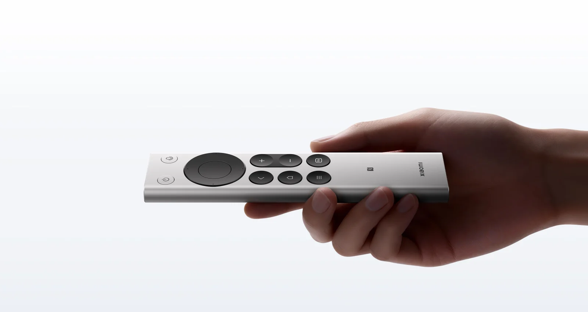
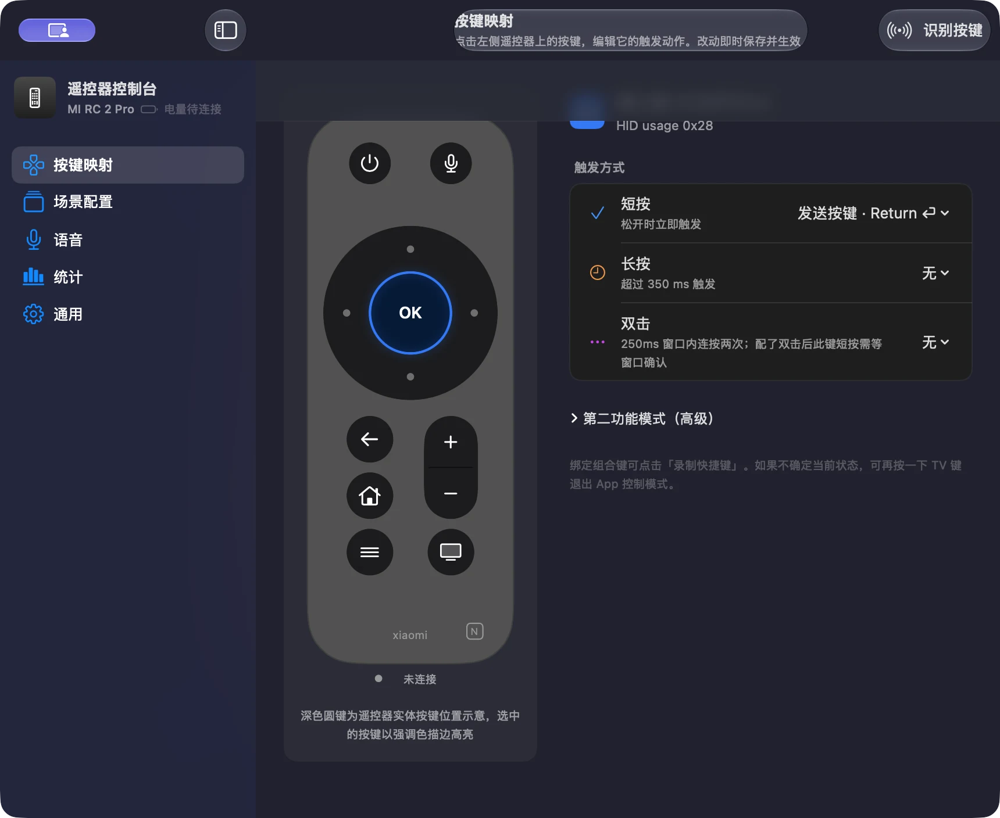
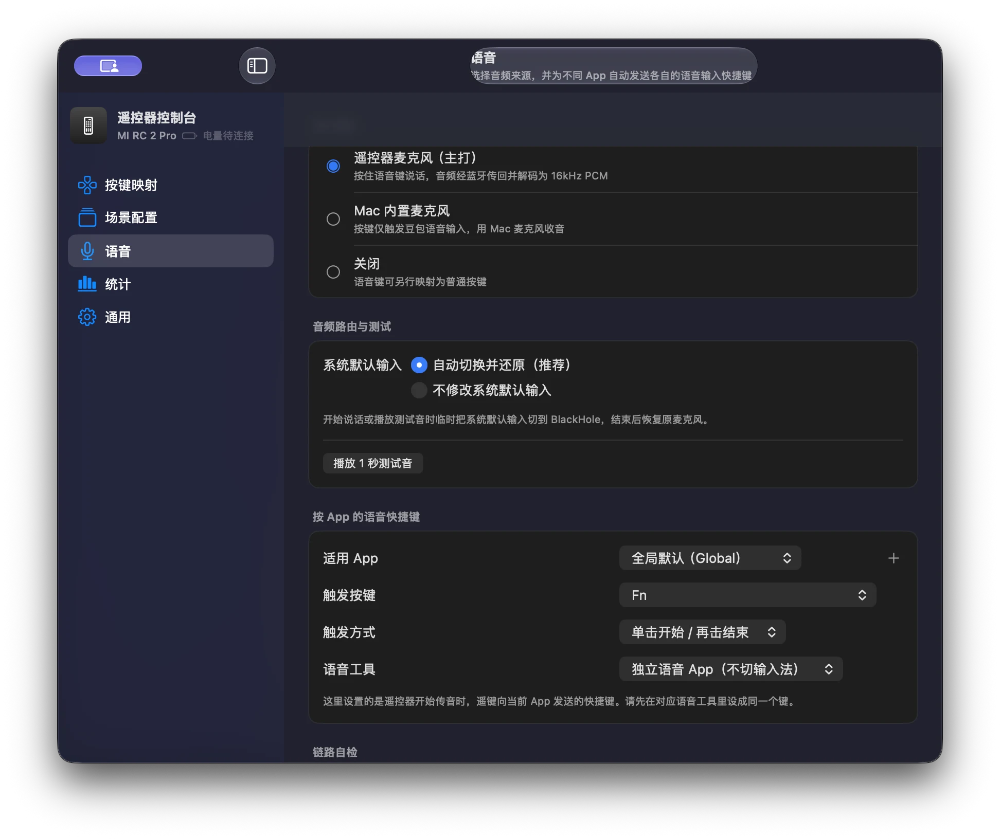
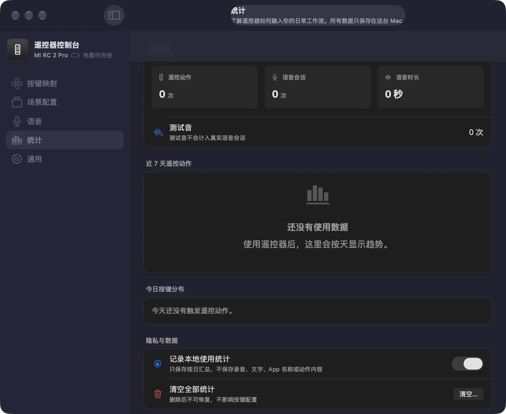

<div align="center">

# 遥键 RemoKey

### 把小米蓝牙遥控器 2 Pro 变成 Mac 的语音与快捷控制器

对着遥控器说话，文字直接进入当前输入框；用 13 个实体按键切 App、选窗口、控制系统，
并通过本地统计了解它是否真正融入日常工作流。

[](https://github.com/maydaychen/mi_remote_control/actions/workflows/ci.yml)
[](https://github.com/maydaychen/mi_remote_control/releases)
[](https://www.apple.com/macos/)
[](https://swift.org)
[](LICENSE)
[](Package.swift)

**中文** · [English](README.en.md)



<sub>硬件产品图 © 小米，仅用于说明适配设备；来源：<a href="https://www.mi.com/xiaomi-bluetooth-remote-2-pro">小米官网</a>。</sub>

</div>

> RemoKey turns the Xiaomi Bluetooth Remote 2 Pro into a native macOS controller. Its HID
> buttons and ATVV microphone travel through independent Bluetooth paths, so one remote can
> handle keyboard automation, app control, and voice input without a third-party runtime.

## 现在可以做什么

| 语音输入 | 快捷控制 | 本地洞察 |
| --- | --- | --- |
| 按住语音键说话，经 ATVV 解码与 BlackHole 把声音交给语音工具 | 短按、长按、双击、第二功能层和按 App 配置，把实体键映射成 Mac 操作 | 按日汇总遥控动作、有效语音和测试音，数据只留在本机 |

### 最新功能

- **一秒测试音**：不用拿起遥控器，也能向 BlackHole 发送固定的 1 kHz 测试音，先确认语音工具是否收到音频。
- **两种音频路由**：可让遥键临时切换系统默认输入并自动还原，也可保持系统设置不变，由豆包、Typeless、superwhisper 等工具固定选择 BlackHole。
- **本地使用统计**：查看今日遥控动作、语音次数与时长、测试音次数、近 7 天趋势和按键分布；支持暂停记录和二次确认清空。
- **退出当前 App**：系统功能菜单新增“退出当前 App”，统一发送 `⌘Q`；危险操作继续使用按住确认保护。

### 核心能力

- **遥控器麦克风语音输入**：ATVV 私有 GATT → IMA ADPCM 解码 → 16 kHz PCM → BlackHole → 目标语音工具。
- **Mac 麦克风模式**：不走遥控器音频，只用实体语音键触发当前 App 的语音快捷键。
- **多触发按键映射**：13 个实体键支持短按、长按、双击、第二功能层和 OK＋方向手势。
- **场景配置**：按前台 App 自动切换覆盖配置，保留全局默认；内置终端、微信、浏览器和视频等预设。
- **窗口与系统控制**：窗口选择、App 轮盘、标签切换、输入框聚焦、鼠标模式、Mission Control、锁屏、睡眠与媒体控制。
- **安全退出与自愈**：退出时清除本程序安装的 `hidutil` 映射；`--doctor` 检查权限、BlackHole、遥控器和残留映射。
- **原生 Swift 6**：运行时只使用 macOS 系统框架，不引入第三方软件包。

## 真实界面

<p align="center">
  <strong>按键映射</strong><br>
  
</p>

<table>
  <tr>
    <td align="center"><strong>语音路由与测试</strong></td>
    <td align="center"><strong>本地使用统计</strong></td>
  </tr>
  <tr>
    <td></td>
    <td></td>
  </tr>
</table>

## 工作原理

按键和语音是遥控器上的两条独立链路，互不依赖：

```text
小米蓝牙遥控器 2 Pro
├─ HID 按键 ──> hidutil 设备级中转 ──> CGEventTap ──> MappingEngine
│                                                  └─> 快捷键 / App / 窗口 / 系统动作
└─ ATVV 语音 ─> CoreBluetooth ─> ADPCM 解码 ─> AudioBridge ─> BlackHole
                                                                    └─> 语音工具出字
```

- HID 路径只处理实体按键；返回键 `usage 0xF1` 继续由 IOHID 监听补充。
- ATVV 路径负责握手、会话和音频帧，解码为 16 kHz、16-bit 单声道 PCM。
- 自动路由只在首个有效音频帧或测试音真正开始后切换输入，结束后恢复原设备。
- 使用统计只接收逻辑动作和聚合音频样本数，不保存录音、识别文字或动作内容。

更完整的协议与架构说明见 [DESIGN.md](DESIGN.md)。

## 使用要求

- macOS 14 或更高版本。
- 小米蓝牙遥控器 2 Pro，蓝牙名为 `MI RC` 系列。
- 输入监控和辅助功能权限；首次启动向导会逐项检查。
- 使用遥控器麦克风时需要 [BlackHole 2ch](https://existential.audio/blackhole/) 以及支持自定义麦克风或语音快捷键的工具。

不安装 BlackHole 时，按键映射、窗口控制、系统功能和 Mac 麦克风模式仍可使用。

## 快速开始

### 使用分发包

1. 从 [Releases](https://github.com/maydaychen/mi_remote_control/releases) 获取 `.dmg` 或 `.zip`，把 `RemoKey.app` 放入“应用程序”。
2. 使用 Apple Developer ID 签名并完成公证的正式版本可直接双击启动。历史预览包仍可能被 Gatekeeper 拦截；正式包如果出现同类提示，请不要绕过安全检查，改从 Releases 重新下载。
3. 按向导授予蓝牙、输入监控和辅助功能权限，修改权限后按提示退出并重新打开。
4. 长按遥控器“主页＋返回”约 3 秒，指示灯闪烁后在 macOS 蓝牙设置中完成配对。
5. 如需遥控器语音，安装 BlackHole 2ch，然后在“语音”页先播放一秒测试音。

> 关闭设置窗口不会退出后台服务。需要完全退出时，请使用菜单栏中的“退出遥键”或 App 菜单。

从旧版 `MiRemote` 升级到 `RemoKey` 时，macOS 会因为 Bundle ID 变化而把它视为新 App，需要重新授予蓝牙、输入监控和辅助功能权限。App 会迁移旧版偏好；配置与统计继续保存在兼容目录 `~/Library/Application Support/MiRemote/`，不会因改名丢失。

### 从源码构建

```bash
./build.sh
.build/miremote --self-test
```

项目使用 `swiftc` 直接构建，并把必要的 `Info.plist` 嵌入 CLI；请使用 `./build.sh`，不要替换为 `swift build`。

需要生成本机开发签名 App 时：

```bash
./scripts/setup-signing.sh   # 检查团队 Apple Development 身份
./scripts/package.sh         # Apple Development 签名，产物带 -development
```

正式站外分发使用 `Developer ID Application + Hardened Runtime + 安全时间戳 + Apple 公证`，完整命令见 [RELEASE-STEPS.md](RELEASE-STEPS.md)。缺少官方证书或公证票据时流程会明确失败，不会静默降级为自签名或 ad-hoc。

## 默认键位

| 实体键 | 默认行为 |
| --- | --- |
| 方向 ↑↓←→ | 光标移动；浮层中移动选择 |
| OK | 回车／确认；按 App 配置可覆盖 |
| 返回 | 删除、取消或关闭浮层 |
| 主页 | 打开调度中心；长按显示当前 App 操作提示 |
| 菜单 | 窗口选择器；长按打开完整系统功能菜单 |
| TV | 进入／退出 App 控制模式；长按打开 App 轮盘 |
| 音量 ± | 系统音量；App 控制模式中切换上一项／下一项 |
| 语音 | 按住说话，或按配置触发当前语音工具 |
| 电源 | 显示器睡眠；长按切换鼠标模式 |

**迷路时长按菜单键 1.5 秒**：无论当前位于哪个层或浮层，都会退出接管态、清空临时状态并返回基础映射。

## 语音路由与测试

| 模式 | 行为 | 适合场景 |
| --- | --- | --- |
| 自动切换并还原 | 语音或测试音开始后临时把系统默认输入切到 BlackHole，结束后恢复 | 希望目标语音工具一直跟随系统默认输入 |
| 不修改系统默认输入 | 遥键不改变系统设置，目标工具固定选择 BlackHole | 不希望通话、录音或其他 App 的默认麦克风被短暂改变 |

测试音固定为 1 秒、1 kHz、峰值 -18 dBFS，并走真实 `AudioBridge → BlackHole` 路径。测试音不会触发语音快捷键，也不会计入真实语音会话。

## 本地使用统计

统计默认开启，只保留最近 90 个自然日的按日汇总：

- 遥控动作触发次数，以及按键和动作大类分布。
- 有效 ATVV 语音会话次数与实际 PCM 样本时长。
- 成功发送到音频链路的测试音次数。

数据保存在 `~/Library/Application Support/MiRemote/usage-stats.json`。它不会保存录音、识别文字、快捷键内容、Shell 内容、前台 App 名称、账号或设备标识，也不会上传网络。关闭统计只停止新增记录；“清空全部统计”需要二次确认并删除历史。

## 自定义配置

映射编辑会区分「继承全局」「不执行」和自定义动作。基础态方向键、返回键、全局 OK 短按保持光标、删除、回车行为，页面会提示保护范围；其他动作可配置到第二功能模式，App 专用 OK 短按仍可自定义发送键。场景速查表显示基础态有效动作。

保存失败时会恢复上次生效配置并提示重试。「识别按键」期间只识别按键，不执行原映射或启动语音输入；退出后会吞掉尚未松开的本次按压。遥控暂停、通道异常、语音或测试音进行中不可进入识别。

配置文件位于 `~/Library/Application Support/MiRemote/config.json`。优先级为：

```text
CLI 标志 > config.json > 内置默认
```

常用 `settings`：

| 字段 | 默认值 | 说明 |
| --- | --- | --- |
| `holdMs` | `350` | 长按判定时间，单位毫秒 |
| `doubleMs` | `250` | 双击窗口，只有配置了双击的按键才延迟短按 |
| `deleteAllOnHold` | `false` | 文字输入态长按返回是否执行全选删除 |
| `remoteVendorID` | `10007` | 小米遥控器 Vendor ID，十进制表示 `0x2717` |
| `remoteProductID` | `12984` | Product ID，十进制表示 `0x32B8` |
| `voiceOutputDevice` | `"BlackHole 2ch"` | 遥控器 PCM 输出及自动路由目标设备 |
| `terminalApps` | `[]` | 追加可由 `focus_input` 直接聚焦的终端类 bundle id |

语音快捷键按 App 保存在 `voiceProfiles` 中，可配置 `keyName`、`mode` 和 `imeBundlePrefix`。图形界面会即时保存绝大多数日常配置，高级用户也可以编辑 JSON。

## 常见问题

<details>
<summary><strong>升级后按键没有反应？</strong></summary>

Bundle ID 或签名身份变化时，macOS 可能要求重新授予输入监控与辅助功能权限。正式版本保持固定 Bundle ID 与 Developer ID 身份；如果权限仍异常，请在对应设置中移除旧条目、重新添加遥键，再完全退出并重开。用户按键配置不会因此丢失。

</details>

<details>
<summary><strong>为什么遥控器语音需要 BlackHole？</strong></summary>

遥键解码得到的是 PCM 音频，需要虚拟声卡把它作为“麦克风”提供给豆包、Typeless、superwhisper 等语音工具。BlackHole 只参与语音链路，不影响按键功能。

</details>

<details>
<summary><strong>退出后遥控器或键盘行为异常？</strong></summary>

正常退出会自动清除遥键安装的 `hidutil` 中转映射。如果进程异常终止后仍有残留，可执行：

```bash
hidutil property --set '{"UserKeyMapping":[]}'
```

</details>

<details>
<summary><strong>Secure Input 期间为什么可能出现中转键？</strong></summary>

密码输入等 Secure Event Input 场景会让系统旁路 `CGEventTap`，而设备级 `hidutil` 映射仍然有效，因此遥控器方向键可能把中转键送入前台。真实键盘不受影响，这是当前已知限制。

</details>

## 开发与验证

```bash
./build.sh
.build/miremote --self-test
python3 scripts/harness/verify.py --repo . --mode task
```

构建与自检不能代替蓝牙事件、ATVV 音频、BlackHole、TCC 权限、Secure Input 和真实 App 控制的真机验收。完整检查范围见 [TESTPLAN.md](TESTPLAN.md) 与 [FIELD-TEST.md](FIELD-TEST.md)。当前状态和未完成事项统一记录在 [ROADMAP.md](ROADMAP.md)。

## 相关文档

- [DESIGN.md](DESIGN.md)：协议、架构与交互取舍。
- [HANDOFF.md](HANDOFF.md)：当前实现结构和维护入口。
- [TESTPLAN.md](TESTPLAN.md)：自动化、集成与人工验收计划。
- [FIELD-TEST.md](FIELD-TEST.md)：真实遥控器与系统权限验收步骤。
- [ROADMAP.md](ROADMAP.md)：当前进度、最近完成和最近验证。

## 致谢

- [godarrenw/mi_remote_control](https://github.com/godarrenw/mi_remote_control)：本项目 fork 的上游项目，为后续功能扩展提供了基础。
- [BlackHole](https://existential.audio/blackhole/)：macOS 开源虚拟声卡。
- 小米蓝牙遥控器 2 Pro 官方产品图来自[小米官网](https://www.mi.com/xiaomi-bluetooth-remote-2-pro)。

## License

[MIT](LICENSE) © RemoKey contributors
